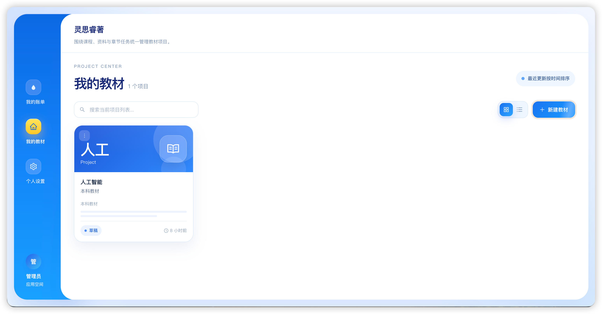
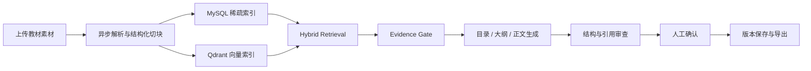

<div align="center">

# 灵思睿著 · Write Agent

### 面向教材与课程内容生产的 AI 写作工作台

从素材解析、证据检索到目录、大纲、正文与导出，让教材编写过程可追溯、可恢复、可协作。

[](https://nextjs.org/)
[](https://nestjs.com/)
[](https://www.mysql.com/)
[](https://redis.io/)
[](https://qdrant.tech/)
[](https://github.com/Siriuskangkang/write-agent/commits/main)



</div>

## 项目简介

灵思睿著是一套面向教材、讲义和课程内容生产的 AI Web 应用。用户上传 PDF、DOCX、PPTX、Markdown 或 TXT 素材后，系统会解析并建立检索索引，再基于素材生成目录、大纲和正文。

它不只负责“写一段文字”，还把长内容生产拆成可恢复的工作流：保存输入快照、记录检索证据、校验结构、审查引用、控制修订次数，并在关键阶段等待人工确认。

## 核心能力

| 能力 | 说明 |
| --- | --- |
| 素材中心 | 批量上传并异步解析 PDF、DOCX、PPTX、MD、TXT |
| 教材工作台 | 在目录、大纲、正文、引用与对话之间连续创作 |
| AI 生成 | 生成目录、大纲、正文，支持改写、扩写与精简 |
| Hybrid RAG | MySQL 稀疏检索与 Qdrant 向量检索融合，支持重排与邻块扩展 |
| 可信引用 | 记录 claim、证据片段、素材来源、检索排名和支持状态 |
| 持久化工作流 | MySQL 保存任务、检查点与事件；Bull Worker 执行耗时任务 |
| 人工审批 | 目录和大纲批准后生效，正文以草稿方式保存并等待接受 |
| 体例模板 | 管理教材写作风格、章节规范与内容约束 |
| 多格式导出 | 异步生成 DOCX 或 Markdown |

## 工作原理



生成任务由 API 创建，Worker 在后台执行。前端通过标准任务接口与 SSE 事件流展示进度；刷新页面后可按任务 ID 恢复，取消状态和错误节点也会持久化。

## 技术架构

```text
┌──────────────────────────────────────────────────────────────┐
│ Next.js 14 · React 18 · Ant Design · Zustand                │
└──────────────────────────────┬───────────────────────────────┘
                               │ REST / SSE
┌──────────────────────────────▼───────────────────────────────┐
│ NestJS API                                                   │
│ Auth · Projects · Materials · Authoring · Citations · Export│
└───────────────┬──────────────────────────────┬───────────────┘
                │                              │ Bull
        ┌───────▼────────┐            ┌────────▼──────────────┐
        │ MySQL 8.4      │            │ Workflow Worker      │
        │ 业务与工作流状态 │            │ Parse · RAG · LLM    │
        └────────────────┘            └───────┬───────────────┘
                                             │
                         ┌───────────────────┼─────────────────┐
                         ▼                   ▼                 ▼
                    Redis 7             Qdrant           LLM Provider
```

### 技术栈

- 前端：Next.js 14、React 18、TypeScript、Ant Design、Zustand、Vitest、Playwright
- 后端：NestJS 11、TypeORM、Bull、Swagger、Jest
- 数据：MySQL 8.4、Redis 7、Qdrant 1.13
- 模型：DeepSeek / Anthropic，可配置 OpenAI Embedding
- 进程：PM2 管理 API、Worker、Web

## 快速开始

### 环境要求

- Node.js 20+
- npm 10+
- Docker Desktop
- PM2：`npm install -g pm2`

### 1. 获取代码并安装依赖

```bash
git clone https://github.com/Siriuskangkang/write-agent.git
cd write-agent

npm install
npm --prefix backend install
npm --prefix frontend install
```

### 2. 准备环境变量

```bash
cp .env.example .env
cp backend/.env.example backend/.env
cp frontend/.env.local.example frontend/.env.local
```

至少需要在 `backend/.env` 中设置：

```dotenv
JWT_SECRET=请替换为足够长的随机字符串
LLM_PROVIDER=deepseek
DEEPSEEK_API_KEY=你的_API_Key
```

示例配置中的 MySQL 和 Redis 凭据已与 Docker Compose 默认值对齐。不要提交真实的 `.env` 或 API Key。

### 3. 启动基础设施

```bash
docker compose up -d mysql redis qdrant
docker compose ps
```

### 4. 初始化并构建

```bash
npm --prefix backend run migration:run
npm --prefix backend run build
npm --prefix frontend run build
```

### 5. 使用 PM2 启动

```bash
pm2 start ecosystem.config.cjs
pm2 status
```

启动后访问：

- Web：<http://localhost:8002>
- API：<http://localhost:3002/api>
- Swagger：<http://localhost:3002/api/docs>
- Qdrant：<http://localhost:6333/dashboard>

PM2 默认启动三个进程：

| 进程 | 职责 |
| --- | --- |
| `write-agent-api` | REST、鉴权、SSE 与任务创建 |
| `write-agent-worker` | 文件解析、工作流、生成、索引和导出 |
| `write-agent-web` | Next.js Web 应用 |

查看日志：

```bash
pm2 logs write-agent-api
pm2 logs write-agent-worker
pm2 logs write-agent-web
```

## 主要目录

```text
write-agent/
├── backend/
│   ├── src/agent/           # 生成链与提示词
│   ├── src/authoring/       # 确定性写作编排
│   ├── src/citation/        # 引用与证据账本
│   ├── src/file/            # 上传、解析与素材管理
│   ├── src/retrieval/       # Hybrid RAG
│   ├── src/workflow/        # 持久化任务、事件与 Worker
│   └── migrations/          # TypeORM 数据库迁移
├── frontend/
│   ├── src/app/             # Next.js App Router 页面
│   ├── src/components/      # 工作台与通用组件
│   ├── src/features/        # 领域功能模块
│   ├── src/services/        # API 客户端
│   └── tests/e2e/           # Playwright 测试
├── docs/                    # 产品、架构、优化与运维文档
├── docker-compose.yml       # MySQL、Redis、Qdrant 与完整应用
└── ecosystem.config.cjs     # PM2 进程配置
```

## 开发与测试

### 后端

```bash
npm --prefix backend run start:dev
npm --prefix backend run lint:check
npm --prefix backend run test
npm --prefix backend run build
```

### 前端

```bash
npm --prefix frontend run dev
npm --prefix frontend run test
npm --prefix frontend run typecheck
npm --prefix frontend run build
```

### RAG 评测

```bash
npm --prefix backend run rag:evaluate
```

> `RETRIEVAL_MODE` 默认使用 `shadow`。切换到 `hybrid` 前，应先完成真实语料评测并配置有效的评测产物与签名。

## 运行模式与安全提示

- `AUTHORING_COMMIT_MODE` 默认是 `off`，确定性写作提交链路需要通过项目白名单显式启用。
- 文件上传、项目资源和生成接口均应保持用户与项目级权限校验。
- 生产环境必须替换 JWT、数据库、Redis 和评测签名密钥。
- MySQL、Redis、Qdrant 默认仅绑定本机地址；不要直接暴露到公网。
- LLM 调用会产生费用，建议配置模型预算、超时与最大输出限制。

## 文档

- [完整优化报告](./docs/optimization-report-2026-07-27.md)
- [运维与健康检查](./docs/operations.md)
- [前端开发方案](./docs/开发方案/教材编写Agent_前端开发方案.md)
- [后端开发方案](./docs/开发方案/教材编写Agent_后端开发方案.md)
- [接口与数据库契约](./docs/开发方案/教材编写Agent_接口与数据库契约.md)

## 项目状态

项目目前处于持续开发阶段。核心创作链路可以本地运行，Hybrid RAG、确定性写作编排和可信引用机制采用安全开关逐步启用，适合继续进行真实语料评测、模型调优和前端体验完善。

欢迎提交 Issue 或 Pull Request。提交代码前，请至少完成相关模块测试、类型检查与构建。

---

<div align="center">

如果这个项目对你有帮助，欢迎点一个 ⭐

</div>
