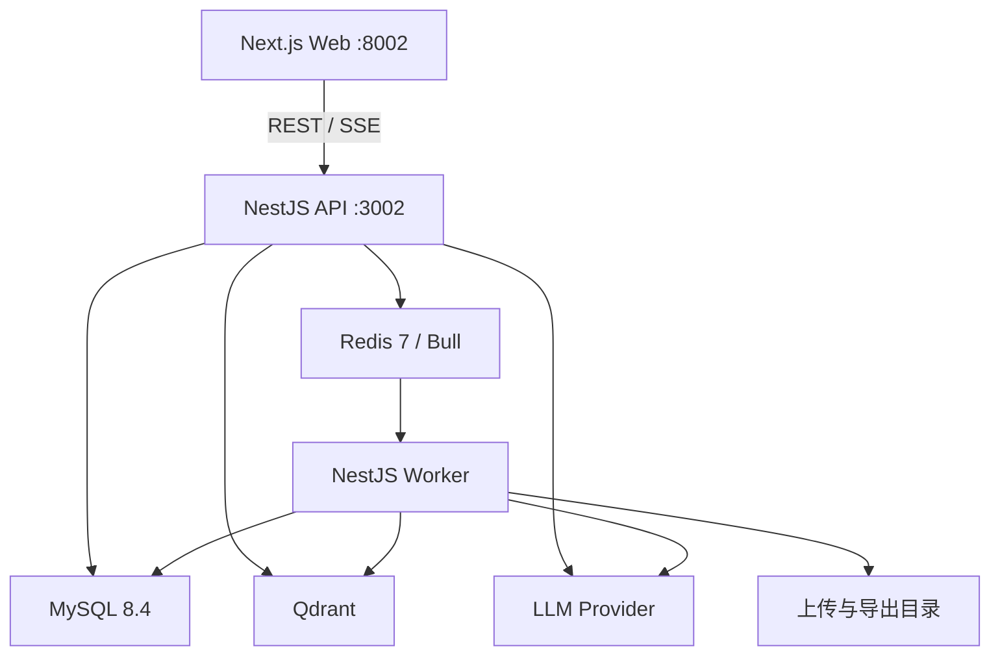

# 系统架构

## 运行拓扑

应用拆为三个 PM2 进程：

| 进程 | 入口 | 职责 |
| --- | --- | --- |
| `write-agent-api` | `backend/dist/src/main.js` | 鉴权、REST、SSE、任务创建和查询 |
| `write-agent-worker` | `backend/dist/src/worker-main.js` | 文件解析、检索索引、生成工作流和导出 |
| `write-agent-web` | Next.js `start -p 8002` | 用户界面 |

MySQL、Redis、Qdrant 由 Docker Compose 提供。`docker-compose.yml` 不承诺完整应用容器化。

## 后端模块

- `auth`：Cookie JWT、刷新令牌和用户资料
- `project`：项目与项目状态
- `file`：上传安全、解析队列和素材生命周期
- `chunk`：parent-child 分块和稀疏检索字段
- `retrieval`：legacy、shadow、hybrid 检索与评测门禁
- `workflow`：任务、事件、检查点、取消和恢复
- `authoring`：确定性写作图、提案和事务提交
- `llm` / `agent`：统一模型网关、provider 和结构化生成链
- `citation`：引用映射、claim-evidence ledger 与 grounding
- `content`：目录、大纲、正文和兼容接口
- `style-template`：体例模板
- `export`：DOCX、Markdown 异步导出
- `operations`：健康检查、指标和请求关联

## 素材与检索

1. `ProjectUploadGuard` 在 Multer 前完成项目权限检查；Multer 的 `fileFilter` 和 `limits` 拒绝不支持的上传声明与超限流。
2. 文件写入隔离目录后，FileService 校验文件签名、实际类型、大小与用户配额；失败时在正式激活前清理隔离文件。
3. Worker 读取校验过的不可变快照。
4. 解析器输出统一 AST，记录标题路径、页码或幻灯片、offset 和版本。
5. 结构化 ingestion 在事务中激活新的文档与 chunk 版本。
6. 稀疏候选来自 MySQL，dense 候选来自 Qdrant。
7. Hybrid 路径执行 query planning、融合、重排、来源配额和邻块扩展。

检索模式：

| 模式 | 行为 |
| --- | --- |
| `legacy` | 仅使用稳定稀疏路径 |
| `shadow` | 对外返回 legacy；Hybrid 运行结果用于评测和对比 |
| `hybrid` | 使用 Hybrid 主路径；必须通过签名评测产物门禁 |

未配置 `OPENAI_API_KEY` 时 dense indexing 停用。Hybrid 激活细节见 [RAG 评测说明](../backend/evaluation/rag/README.md)。

## 工作流与一致性

`workflow_jobs` 保存状态与输入快照，`workflow_events` 保存单调递增事件，`model_runs` 保存调用结果、token、成本和错误。API 只创建与查询任务，Worker 获取执行租约后推进状态。

关键约束：

- 重复请求通过幂等键返回原任务。
- 取消状态持久化，终止信号传入模型调用。
- 终态不能反转，例如已取消任务不能再变为成功。
- 目录、大纲和正文由服务端解析、验证并事务保存。
- 版本号和 current version 通过事务与唯一约束维护。
- SSE 支持 `Last-Event-ID` 恢复，页面刷新后按 job ID 继续。

## 写作与引用开关

- `AUTHORING_COMMIT_MODE=off`：默认，不启用确定性提交。
- `AUTHORING_COMMIT_MODE=shadow`：执行验证但不替换正式结果。
- `AUTHORING_COMMIT_MODE=enforce_allowlist`：仅对项目白名单启用。
- `ATOMIC_GROUNDING_MODE=off`：默认关闭。
- `ATOMIC_GROUNDING_MODE=shadow_no_persist`：验证并输出 shadow 结果，不持久化为正式内容。

Storage authority 默认 `legacy`。Broker 代码存在，但当前公开部署流程不提供激活承诺。

## 权威来源

- REST/SSE：控制器、DTO 和运行时 Swagger
- 数据库：TypeORM migrations 与实体
- 环境变量：`.env.example`、`backend/.env.example`
- 进程：`ecosystem.config.cjs`
- 本地基础设施：`docker-compose.yml`
