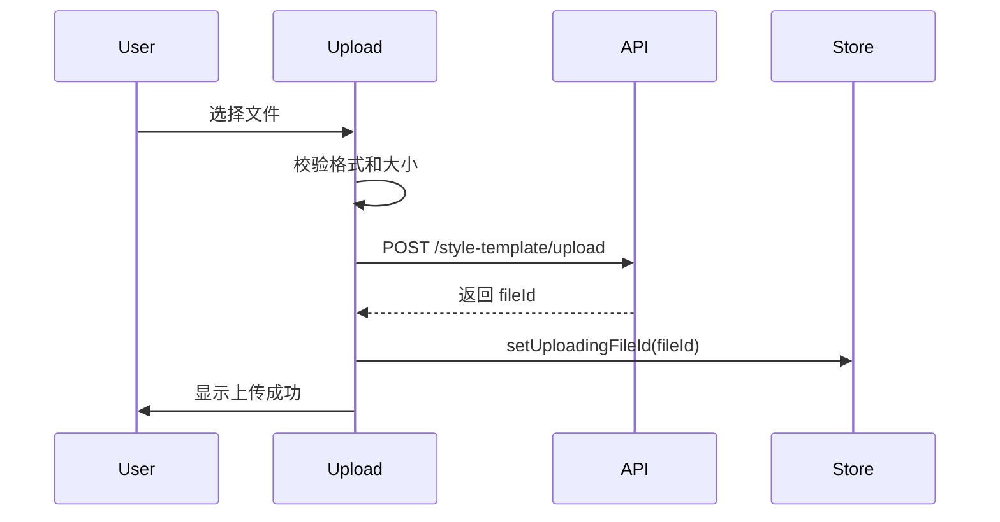
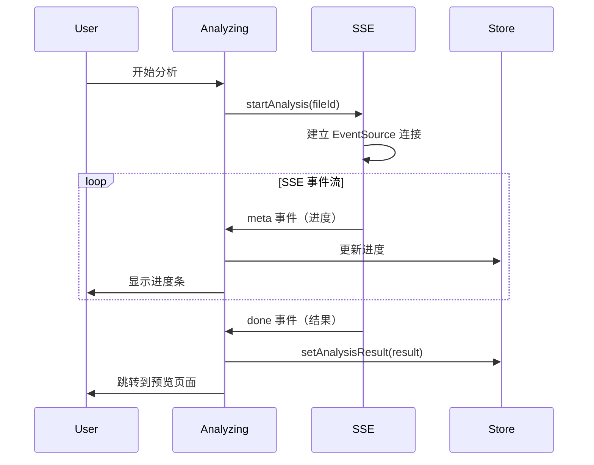
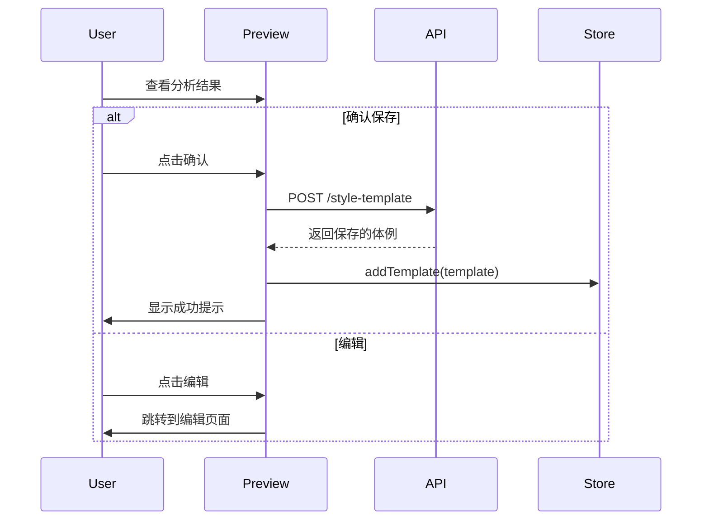
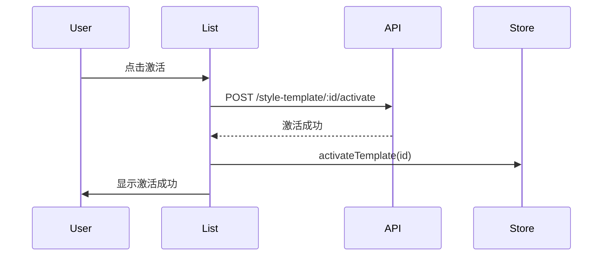

# 体例管理功能 - 前端开发文档

## 1. 页面路由

### 路由路径
```
/style-templates
```

### 页面层级
```
app/
└── style-templates/
    └── page.tsx          # 体例管理主页面
```

## 2. 组件结构

### 目录结构
```
src/
├── components/
│   └── style-template/
│       ├── StyleTemplateUpload.tsx      # 上传组件
│       ├── StyleTemplateAnalyzing.tsx   # 分析中状态
│       ├── StyleTemplatePreview.tsx     # 结果预览
│       ├── StyleTemplateEditor.tsx      # 手动编辑
│       └── StyleTemplateList.tsx        # 体例列表
├── stores/
│   └── styleTemplateStore.ts            # 状态管理
├── services/
│   └── styleTemplate.ts                 # API 服务
└── hooks/
    └── useStyleTemplateSSE.ts           # SSE hook

```

### 组件职责说明

| 组件 | 职责 |
|------|------|
| StyleTemplateUpload | 文件上传入口，支持拖拽和点击上传 |
| StyleTemplateAnalyzing | 显示分析进度，SSE 实时更新状态 |
| StyleTemplatePreview | 展示分析结果，支持确认或重新编辑 |
| StyleTemplateEditor | 手动编辑体例规则，表单验证 |
| StyleTemplateList | 体例列表展示，支持激活/删除操作 |

## 3. 核心组件设计

### 3.1 StyleTemplateUpload

**Props 定义**
```typescript
interface StyleTemplateUploadProps {
  onUploadSuccess: (fileId: string) => void;
  onUploadError: (error: string) => void;
}
```

**UI 设计**
```tsx
import { Upload, message } from 'antd';
import { InboxOutlined } from '@ant-design/icons';
import { useState } from 'react';
import { uploadStyleTemplateFile } from '@/services/styleTemplate';

export function StyleTemplateUpload({ onUploadSuccess, onUploadError }: StyleTemplateUploadProps) {
  const [uploading, setUploading] = useState(false);

  const handleUpload = async (file: File) => {
    setUploading(true);
    try {
      const result = await uploadStyleTemplateFile(file);
      message.success('文件上传成功');
      onUploadSuccess(result.fileId);
    } catch (error) {
      const errorMsg = error instanceof Error ? error.message : '上传失败';
      message.error(errorMsg);
      onUploadError(errorMsg);
    } finally {
      setUploading(false);
    }
    return false;
  };

  return (
    <Upload.Dragger
      name="file"
      multiple={false}
      accept=".docx,.pdf"
      beforeUpload={handleUpload}
      showUploadList={false}
      disabled={uploading}
    >
      <p className="ant-upload-drag-icon">
        <InboxOutlined />
      </p>
      <p className="ant-upload-text">点击或拖拽文件到此区域上传</p>
      <p className="ant-upload-hint">支持 DOCX、PDF 格式，文件大小不超过 10MB</p>
    </Upload.Dragger>
  );
}
```

**交互逻辑**
1. 用户选择或拖拽文件
2. 前端校验文件格式和大小
3. 调用上传 API
4. 上传成功后触发 `onUploadSuccess` 回调
5. 上传失败显示错误提示

### 3.2 StyleTemplateAnalyzing

**Props 定义**
```typescript
interface StyleTemplateAnalyzingProps {
  fileId: string;
  onAnalysisComplete: (result: StyleTemplateAnalysisResult) => void;
  onAnalysisError: (error: string) => void;
}

interface StyleTemplateAnalysisResult {
  id: string;
  name: string;
  rules: StyleRule[];
}
```

**UI 设计**
```tsx
import { Card, Progress, Spin, Typography } from 'antd';
import { useEffect } from 'react';
import { useStyleTemplateSSE } from '@/hooks/useStyleTemplateSSE';

const { Text } = Typography;

export function StyleTemplateAnalyzing({
  fileId,
  onAnalysisComplete,
  onAnalysisError
}: StyleTemplateAnalyzingProps) {
  const { progress, status, result, error, startAnalysis } = useStyleTemplateSSE();

  useEffect(() => {
    startAnalysis(fileId);
  }, [fileId]);

  useEffect(() => {
    if (status === 'done' && result) {
      onAnalysisComplete(result);
    }
    if (status === 'error' && error) {
      onAnalysisError(error);
    }
  }, [status, result, error]);

  return (
    <Card>
      <div style={{ textAlign: 'center', padding: '40px 0' }}>
        <Spin size="large" />
        <div style={{ marginTop: 24 }}>
          <Text strong>正在分析体例规则...</Text>
        </div>
        <Progress
          percent={progress}
          status="active"
          style={{ marginTop: 16, maxWidth: 400, margin: '16px auto 0' }}
        />
      </div>
    </Card>
  );
}
```

**交互逻辑**
1. 组件挂载后自动开始 SSE 分析
2. 实时更新进度条
3. 分析完成后触发 `onAnalysisComplete`
4. 分析失败触发 `onAnalysisError`

### 3.3 StyleTemplatePreview

**Props 定义**
```typescript
interface StyleTemplatePreviewProps {
  result: StyleTemplateAnalysisResult;
  onConfirm: () => void;
  onEdit: () => void;
}
```

**UI 设计**
```tsx
import { Card, Button, Space, Descriptions, Tag } from 'antd';
import { CheckOutlined, EditOutlined } from '@ant-design/icons';

export function StyleTemplatePreview({ result, onConfirm, onEdit }: StyleTemplatePreviewProps) {
  return (
    <Card
      title="体例分析结果"
      extra={
        <Space>
          <Button icon={<EditOutlined />} onClick={onEdit}>
            编辑
          </Button>
          <Button type="primary" icon={<CheckOutlined />} onClick={onConfirm}>
            确认保存
          </Button>
        </Space>
      }
    >
      <Descriptions column={1} bordered>
        <Descriptions.Item label="体例名称">{result.name}</Descriptions.Item>
        <Descriptions.Item label="规则数量">
          <Tag color="blue">{result.rules.length} 条</Tag>
        </Descriptions.Item>
      </Descriptions>

      <div style={{ marginTop: 24 }}>
        <h4>规则列表</h4>
        {result.rules.map((rule, index) => (
          <Card key={index} size="small" style={{ marginBottom: 8 }}>
            <div><strong>{rule.category}</strong></div>
            <div style={{ marginTop: 8 }}>{rule.description}</div>
            {rule.example && (
              <div style={{ marginTop: 8, color: '#666' }}>
                示例：{rule.example}
              </div>
            )}
          </Card>
        ))}
      </div>
    </Card>
  );
}
```

**交互逻辑**
1. 展示分析结果的体例名称和规则列表
2. 点击"编辑"进入手动编辑模式
3. 点击"确认保存"调用保存 API

### 3.4 StyleTemplateEditor

**Props 定义**
```typescript
interface StyleTemplateEditorProps {
  initialData?: Partial<StyleTemplateData>;
  onSave: (data: StyleTemplateData) => void;
  onCancel: () => void;
}

interface StyleTemplateData {
  name: string;
  rules: StyleRule[];
}

interface StyleRule {
  category: string;
  description: string;
  example?: string;
}
```

**UI 设计**
```tsx
import { Form, Input, Button, Space, Card } from 'antd';
import { MinusCircleOutlined, PlusOutlined } from '@ant-design/icons';

export function StyleTemplateEditor({ initialData, onSave, onCancel }: StyleTemplateEditorProps) {
  const [form] = Form.useForm();

  const handleSubmit = (values: StyleTemplateData) => {
    onSave(values);
  };

  return (
    <Card title="编辑体例">
      <Form
        form={form}
        layout="vertical"
        initialValues={initialData}
        onFinish={handleSubmit}
      >
        <Form.Item
          label="体例名称"
          name="name"
          rules={[{ required: true, message: '请输入体例名称' }]}
        >
          <Input placeholder="例如：学术论文体例" />
        </Form.Item>

        <Form.List name="rules">
          {(fields, { add, remove }) => (
            <>
              {fields.map(({ key, name, ...restField }) => (
                <Card key={key} size="small" style={{ marginBottom: 16 }}>
                  <Space direction="vertical" style={{ width: '100%' }}>
                    <Form.Item
                      {...restField}
                      name={[name, 'category']}
                      rules={[{ required: true, message: '请输入规则类别' }]}
                    >
                      <Input placeholder="规则类别（如：标题格式）" />
                    </Form.Item>
                    <Form.Item
                      {...restField}
                      name={[name, 'description']}
                      rules={[{ required: true, message: '请输入规则描述' }]}
                    >
                      <Input.TextArea placeholder="规则描述" rows={3} />
                    </Form.Item>
                    <Form.Item {...restField} name={[name, 'example']}>
                      <Input placeholder="示例（可选）" />
                    </Form.Item>
                    <Button
                      type="link"
                      danger
                      icon={<MinusCircleOutlined />}
                      onClick={() => remove(name)}
                    >
                      删除规则
                    </Button>
                  </Space>
                </Card>
              ))}
              <Button type="dashed" onClick={() => add()} block icon={<PlusOutlined />}>
                添加规则
              </Button>
            </>
          )}
        </Form.List>

        <Form.Item style={{ marginTop: 24 }}>
          <Space>
            <Button type="primary" htmlType="submit">
              保存
            </Button>
            <Button onClick={onCancel}>取消</Button>
          </Space>
        </Form.Item>
      </Form>
    </Card>
  );
}
```

**交互逻辑**
1. 支持新建或编辑体例
2. 动态添加/删除规则项
3. 表单验证必填字段
4. 保存时触发 `onSave` 回调

### 3.5 StyleTemplateList

**Props 定义**
```typescript
interface StyleTemplateListProps {
  templates: StyleTemplate[];
  activeTemplateId?: string;
  onActivate: (id: string) => void;
  onDelete: (id: string) => void;
  onEdit: (id: string) => void;
}

interface StyleTemplate {
  id: string;
  name: string;
  rulesCount: number;
  isActive: boolean;
  createdAt: string;
}
```

**UI 设计**
```tsx
import { Table, Button, Space, Tag, Popconfirm, message } from 'antd';
import { CheckCircleOutlined, EditOutlined, DeleteOutlined } from '@ant-design/icons';
import type { ColumnsType } from 'antd/es/table';

export function StyleTemplateList({
  templates,
  activeTemplateId,
  onActivate,
  onDelete,
  onEdit
}: StyleTemplateListProps) {
  const columns: ColumnsType<StyleTemplate> = [
    {
      title: '体例名称',
      dataIndex: 'name',
      key: 'name',
      render: (name, record) => (
        <Space>
          {name}
          {record.isActive && <Tag color="green">已激活</Tag>}
        </Space>
      )
    },
    {
      title: '规则数量',
      dataIndex: 'rulesCount',
      key: 'rulesCount',
      width: 120
    },
    {
      title: '创建时间',
      dataIndex: 'createdAt',
      key: 'createdAt',
      width: 180,
      render: (date) => new Date(date).toLocaleString('zh-CN')
    },
    {
      title: '操作',
      key: 'actions',
      width: 200,
      render: (_, record) => (
        <Space>
          {!record.isActive && (
            <Button
              type="link"
              size="small"
              icon={<CheckCircleOutlined />}
              onClick={() => onActivate(record.id)}
            >
              激活
            </Button>
          )}
          <Button
            type="link"
            size="small"
            icon={<EditOutlined />}
            onClick={() => onEdit(record.id)}
          >
            编辑
          </Button>
          <Popconfirm
            title="确认删除此体例？"
            onConfirm={() => onDelete(record.id)}
            okText="确认"
            cancelText="取消"
          >
            <Button type="link" size="small" danger icon={<DeleteOutlined />}>
              删除
            </Button>
          </Popconfirm>
        </Space>
      )
    }
  ];

  return <Table columns={columns} dataSource={templates} rowKey="id" />;
}
```

**交互逻辑**
1. 展示所有体例列表
2. 高亮显示已激活的体例
3. 支持激活、编辑、删除操作
4. 删除前弹出确认对话框

## 4. 状态管理

### Zustand Store 设计

```typescript
// src/stores/styleTemplateStore.ts
import { create } from 'zustand';

interface StyleRule {
  category: string;
  description: string;
  example?: string;
}

interface StyleTemplate {
  id: string;
  name: string;
  rules: StyleRule[];
  isActive: boolean;
  createdAt: string;
}

interface StyleTemplateState {
  // 状态字段
  templates: StyleTemplate[];
  activeTemplateId: string | null;
  currentTemplate: StyleTemplate | null;
  uploadingFileId: string | null;
  analyzing: boolean;
  analysisResult: StyleTemplateAnalysisResult | null;

  // Actions
  setTemplates: (templates: StyleTemplate[]) => void;
  setActiveTemplateId: (id: string | null) => void;
  setCurrentTemplate: (template: StyleTemplate | null) => void;
  setUploadingFileId: (fileId: string | null) => void;
  setAnalyzing: (analyzing: boolean) => void;
  setAnalysisResult: (result: StyleTemplateAnalysisResult | null) => void;
  addTemplate: (template: StyleTemplate) => void;
  updateTemplate: (id: string, updates: Partial<StyleTemplate>) => void;
  deleteTemplate: (id: string) => void;
  activateTemplate: (id: string) => void;
  reset: () => void;
}

const initialState = {
  templates: [],
  activeTemplateId: null,
  currentTemplate: null,
  uploadingFileId: null,
  analyzing: false,
  analysisResult: null
};

export const useStyleTemplateStore = create<StyleTemplateState>((set) => ({
  ...initialState,

  setTemplates: (templates) => set({ templates }),

  setActiveTemplateId: (id) => set({ activeTemplateId: id }),

  setCurrentTemplate: (template) => set({ currentTemplate: template }),

  setUploadingFileId: (fileId) => set({ uploadingFileId: fileId }),

  setAnalyzing: (analyzing) => set({ analyzing }),

  setAnalysisResult: (result) => set({ analysisResult: result }),

  addTemplate: (template) =>
    set((state) => ({ templates: [...state.templates, template] })),

  updateTemplate: (id, updates) =>
    set((state) => ({
      templates: state.templates.map((t) => (t.id === id ? { ...t, ...updates } : t))
    })),

  deleteTemplate: (id) =>
    set((state) => ({
      templates: state.templates.filter((t) => t.id !== id),
      activeTemplateId: state.activeTemplateId === id ? null : state.activeTemplateId
    })),

  activateTemplate: (id) =>
    set((state) => ({
      templates: state.templates.map((t) => ({ ...t, isActive: t.id === id })),
      activeTemplateId: id
    })),

  reset: () => set(initialState)
}));
```

### 状态字段说明

| 字段 | 类型 | 说明 |
|------|------|------|
| templates | StyleTemplate[] | 所有体例列表 |
| activeTemplateId | string \| null | 当前激活的体例 ID |
| currentTemplate | StyleTemplate \| null | 当前正在编辑的体例 |
| uploadingFileId | string \| null | 正在上传的文件 ID |
| analyzing | boolean | 是否正在分析 |
| analysisResult | StyleTemplateAnalysisResult \| null | 分析结果 |

## 5. API 调用

### API 服务封装

```typescript
// src/services/styleTemplate.ts
import ky from 'ky';

const api = ky.create({
  prefixUrl: process.env.NEXT_PUBLIC_API_URL,
  credentials: 'include',
  timeout: 60000
});

// 上传体例文件
export async function uploadStyleTemplateFile(file: File): Promise<{ fileId: string }> {
  const formData = new FormData();
  formData.append('file', file);

  return api.post('style-template/upload', { body: formData }).json();
}

// 获取体例列表
export async function getStyleTemplates(): Promise<StyleTemplate[]> {
  return api.get('style-template').json();
}

// 获取单个体例详情
export async function getStyleTemplate(id: string): Promise<StyleTemplate> {
  return api.get(`style-template/${id}`).json();
}

// 保存体例（新建或更新）
export async function saveStyleTemplate(data: {
  id?: string;
  name: string;
  rules: StyleRule[];
}): Promise<StyleTemplate> {
  if (data.id) {
    return api.put(`style-template/${data.id}`, { json: data }).json();
  }
  return api.post('style-template', { json: data }).json();
}

// 激活体例
export async function activateStyleTemplate(id: string): Promise<void> {
  await api.post(`style-template/${id}/activate`).json();
}

// 删除体例
export async function deleteStyleTemplate(id: string): Promise<void> {
  await api.delete(`style-template/${id}`).json();
}
```

### 请求/响应类型定义

```typescript
// src/types/styleTemplate.ts

export interface StyleRule {
  category: string;
  description: string;
  example?: string;
}

export interface StyleTemplate {
  id: string;
  name: string;
  rules: StyleRule[];
  isActive: boolean;
  createdAt: string;
  updatedAt: string;
}

export interface StyleTemplateAnalysisResult {
  id: string;
  name: string;
  rules: StyleRule[];
}

export interface UploadResponse {
  fileId: string;
}
```

### 错误处理

```typescript
// src/services/styleTemplate.ts (续)

export async function handleApiError(error: unknown): Promise<string> {
  if (error instanceof Error) {
    try {
      const response = await (error as any).response?.json();
      return response?.message || error.message;
    } catch {
      return error.message;
    }
  }
  return '未知错误';
}

// 使用示例
try {
  await saveStyleTemplate(data);
} catch (error) {
  const errorMsg = await handleApiError(error);
  message.error(errorMsg);
}
```

## 6. SSE 处理

### useSSE Hook 设计

```typescript
// src/hooks/useStyleTemplateSSE.ts
import { useState, useCallback, useRef } from 'react';
import { message } from 'antd';

interface SSEState {
  progress: number;
  status: 'idle' | 'connecting' | 'analyzing' | 'done' | 'error';
  result: StyleTemplateAnalysisResult | null;
  error: string | null;
}

export function useStyleTemplateSSE() {
  const [state, setState] = useState<SSEState>({
    progress: 0,
    status: 'idle',
    result: null,
    error: null
  });

  const eventSourceRef = useRef<EventSource | null>(null);
  const reconnectCountRef = useRef(0);
  const maxReconnects = 3;

  const cleanup = useCallback(() => {
    if (eventSourceRef.current) {
      eventSourceRef.current.close();
      eventSourceRef.current = null;
    }
  }, []);

  const startAnalysis = useCallback((fileId: string) => {
    cleanup();

    setState({
      progress: 0,
      status: 'connecting',
      result: null,
      error: null
    });

    const url = `${process.env.NEXT_PUBLIC_API_URL}/style-template/analyze/${fileId}`;
    const eventSource = new EventSource(url, { withCredentials: true });
    eventSourceRef.current = eventSource;

    eventSource.addEventListener('meta', (event) => {
      const data = JSON.parse(event.data);
      setState((prev) => ({
        ...prev,
        status: 'analyzing',
        progress: data.progress || 0
      }));
    });

    eventSource.addEventListener('done', (event) => {
      const result = JSON.parse(event.data);
      setState({
        progress: 100,
        status: 'done',
        result,
        error: null
      });
      cleanup();
      reconnectCountRef.current = 0;
    });

    eventSource.addEventListener('error', (event) => {
      const errorData = event.data ? JSON.parse(event.data) : null;
      const errorMsg = errorData?.message || '分析失败';

      setState({
        progress: 0,
        status: 'error',
        result: null,
        error: errorMsg
      });

      message.error(errorMsg);
      cleanup();
    });

    eventSource.onerror = () => {
      if (reconnectCountRef.current < maxReconnects) {
        reconnectCountRef.current++;
        message.warning(`连接断开，正在重连 (${reconnectCountRef.current}/${maxReconnects})`);
        setTimeout(() => startAnalysis(fileId), 2000);
      } else {
        setState((prev) => ({
          ...prev,
          status: 'error',
          error: '连接失败，请重试'
        }));
        cleanup();
      }
    };
  }, [cleanup]);

  const cancel = useCallback(() => {
    cleanup();
    setState({
      progress: 0,
      status: 'idle',
      result: null,
      error: null
    });
  }, [cleanup]);

  return {
    ...state,
    startAnalysis,
    cancel
  };
}
```

### 实时状态更新

SSE 事件流：
1. **meta** - 元数据事件，包含进度信息
2. **token** - 流式 token（可选）
3. **done** - 分析完成，包含完整结果
4. **error** - 分析失败，包含错误信息

### 重连机制

- 最多重连 3 次
- 每次重连间隔 2 秒
- 超过最大重连次数后显示错误

## 7. UI 交互流程

### 上传流程



### 分析流程



### 预览流程



### 激活流程



## 8. 样式规范

### Ant Design 组件使用

**推荐组件**
- **Upload.Dragger** - 文件上传
- **Card** - 内容容器
- **Form** - 表单输入
- **Table** - 列表展示
- **Progress** - 进度条
- **Button** - 操作按钮
- **Space** - 间距布局
- **Popconfirm** - 确认对话框
- **message** - 消息提示

**主题配置**
```typescript
// app/layout.tsx
import { ConfigProvider } from 'antd';
import zhCN from 'antd/locale/zh_CN';

export default function RootLayout({ children }: { children: React.ReactNode }) {
  return (
    <ConfigProvider
      locale={zhCN}
      theme={{
        token: {
          colorPrimary: '#1890ff',
          borderRadius: 4
        }
      }}
    >
      {children}
    </ConfigProvider>
  );
}
```

### 布局设计

**页面布局**
```tsx
// app/style-templates/page.tsx
import { Layout, Tabs } from 'antd';
import { StyleTemplateUpload } from '@/components/style-template/StyleTemplateUpload';
import { StyleTemplateList } from '@/components/style-template/StyleTemplateList';

const { Content } = Layout;

export default function StyleTemplatePage() {
  return (
    <Layout style={{ minHeight: '100vh', background: '#f0f2f5' }}>
      <Content style={{ padding: '24px' }}>
        <div style={{ maxWidth: 1200, margin: '0 auto' }}>
          <Tabs
            items={[
              {
                key: 'upload',
                label: '上传体例',
                children: <StyleTemplateUpload />
              },
              {
                key: 'list',
                label: '体例列表',
                children: <StyleTemplateList />
              }
            ]}
          />
        </div>
      </Content>
    </Layout>
  );
}
```

**卡片间距**
```css
.style-template-card {
  margin-bottom: 16px;
}

.style-template-card:last-child {
  margin-bottom: 0;
}
```

### 响应式处理

**断点定义**
```typescript
const breakpoints = {
  xs: 480,
  sm: 576,
  md: 768,
  lg: 992,
  xl: 1200,
  xxl: 1600
};
```

**响应式布局**
```tsx
import { Grid } from 'antd';

const { useBreakpoint } = Grid;

export function ResponsiveComponent() {
  const screens = useBreakpoint();

  return (
    <div style={{ padding: screens.md ? 24 : 16 }}>
      {/* 内容 */}
    </div>
  );
}
```

**表格响应式**
```tsx
<Table
  columns={columns}
  dataSource={data}
  scroll={{ x: 800 }}
  pagination={{
    pageSize: screens.md ? 10 : 5,
    showSizeChanger: screens.md
  }}
/>
```

## 9. 完整页面示例

```tsx
// app/style-templates/page.tsx
'use client';

import { useState, useEffect } from 'react';
import { Layout, Tabs, message } from 'antd';
import { StyleTemplateUpload } from '@/components/style-template/StyleTemplateUpload';
import { StyleTemplateAnalyzing } from '@/components/style-template/StyleTemplateAnalyzing';
import { StyleTemplatePreview } from '@/components/style-template/StyleTemplatePreview';
import { StyleTemplateEditor } from '@/components/style-template/StyleTemplateEditor';
import { StyleTemplateList } from '@/components/style-template/StyleTemplateList';
import { useStyleTemplateStore } from '@/stores/styleTemplateStore';
import {
  getStyleTemplates,
  saveStyleTemplate,
  activateStyleTemplate,
  deleteStyleTemplate
} from '@/services/styleTemplate';

const { Content } = Layout;

type ViewMode = 'upload' | 'analyzing' | 'preview' | 'edit' | 'list';

export default function StyleTemplatePage() {
  const [viewMode, setViewMode] = useState<ViewMode>('list');
  const {
    templates,
    uploadingFileId,
    analysisResult,
    setTemplates,
    setUploadingFileId,
    setAnalysisResult,
    addTemplate,
    activateTemplate: activateTemplateInStore,
    deleteTemplate: deleteTemplateInStore
  } = useStyleTemplateStore();

  useEffect(() => {
    loadTemplates();
  }, []);

  const loadTemplates = async () => {
    try {
      const data = await getStyleTemplates();
      setTemplates(data);
    } catch (error) {
      message.error('加载体例列表失败');
    }
  };

  const handleUploadSuccess = (fileId: string) => {
    setUploadingFileId(fileId);
    setViewMode('analyzing');
  };

  const handleAnalysisComplete = (result: any) => {
    setAnalysisResult(result);
    setViewMode('preview');
  };

  const handleConfirmSave = async () => {
    if (!analysisResult) return;

    try {
      const saved = await saveStyleTemplate({
        name: analysisResult.name,
        rules: analysisResult.rules
      });
      addTemplate(saved);
      message.success('体例保存成功');
      setViewMode('list');
      setAnalysisResult(null);
    } catch (error) {
      message.error('保存失败');
    }
  };

  const handleActivate = async (id: string) => {
    try {
      await activateStyleTemplate(id);
      activateTemplateInStore(id);
      message.success('激活成功');
    } catch (error) {
      message.error('激活失败');
    }
  };

  const handleDelete = async (id: string) => {
    try {
      await deleteStyleTemplate(id);
      deleteTemplateInStore(id);
      message.success('删除成功');
    } catch (error) {
      message.error('删除失败');
    }
  };

  return (
    <Layout style={{ minHeight: '100vh', background: '#f0f2f5' }}>
      <Content style={{ padding: '24px' }}>
        <div style={{ maxWidth: 1200, margin: '0 auto' }}>
          {viewMode === 'upload' && (
            <StyleTemplateUpload
              onUploadSuccess={handleUploadSuccess}
              onUploadError={(error) => message.error(error)}
            />
          )}

          {viewMode === 'analyzing' && uploadingFileId && (
            <StyleTemplateAnalyzing
              fileId={uploadingFileId}
              onAnalysisComplete={handleAnalysisComplete}
              onAnalysisError={(error) => message.error(error)}
            />
          )}

          {viewMode === 'preview' && analysisResult && (
            <StyleTemplatePreview
              result={analysisResult}
              onConfirm={handleConfirmSave}
              onEdit={() => setViewMode('edit')}
            />
          )}

          {viewMode === 'list' && (
            <Tabs
              items={[
                {
                  key: 'list',
                  label: '体例列表',
                  children: (
                    <StyleTemplateList
                      templates={templates}
                      onActivate={handleActivate}
                      onDelete={handleDelete}
                      onEdit={(id) => {
                        // 加载体例详情并进入编辑模式
                      }}
                    />
                  )
                },
                {
                  key: 'upload',
                  label: '上传新体例',
                  children: (
                    <StyleTemplateUpload
                      onUploadSuccess={handleUploadSuccess}
                      onUploadError={(error) => message.error(error)}
                    />
                  )
                }
              ]}
            />
          )}
        </div>
      </Content>
    </Layout>
  );
}
```

## 10. 开发注意事项

1. **类型安全**：所有 API 调用和状态管理都使用 TypeScript 类型定义
2. **错误处理**：统一使用 `message.error()` 显示错误提示
3. **加载状态**：上传和分析过程中禁用相关操作按钮
4. **SSE 清理**：组件卸载时关闭 EventSource 连接
5. **表单验证**：使用 Ant Design Form 的内置验证规则
6. **权限控制**：已激活的体例不显示"激活"按钮
7. **确认对话框**：删除操作前使用 Popconfirm 确认
8. **响应式设计**：使用 Grid.useBreakpoint 适配不同屏幕尺寸